# Getting Started

This guide walks you through setting up Clonarr from a fresh install — adding instances, syncing profiles, updating quality sizes, and applying file naming schemes.

---

## 1. Add Instances

After installing Clonarr, the first step is connecting your Radarr and/or Sonarr instances.

Go to the **Settings** tab. You'll see an empty instance list with a prompt to add your first instance.

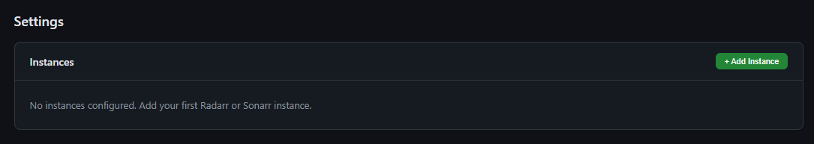

Click **+ Add Instance** to open the configuration modal.

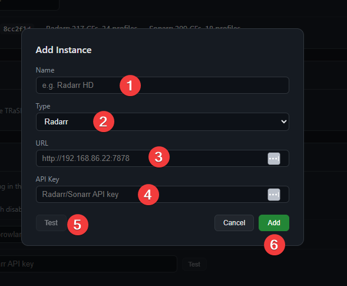

Fill in the fields:

1. **Name** — A label for this instance (e.g. "Radarr HD", "Sonarr 4K")
2. **Type** — Select Radarr or Sonarr
3. **URL** — The full URL to your instance (e.g. `http://192.168.86.22:7878`). Docker hostnames like `radarr:7878` also work — Clonarr will auto-prepend `http://`
4. **API Key** — Found in your Radarr/Sonarr under Settings > General > API Key
5. **Test** — Click to verify the connection before adding
6. **Add** — Save the instance

Repeat for each Radarr/Sonarr instance you want to manage. Once added, the Settings page shows all connected instances with their status.

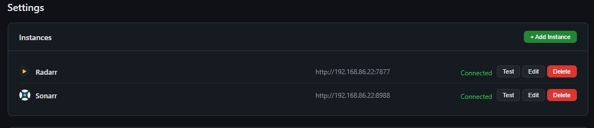

You can **Test**, **Edit**, or **Delete** any instance at any time.

---

## 2. Sync a Profile

With instances connected, you can now sync TRaSH Guides quality profiles to your Radarr or Sonarr.

### Browse profiles

Switch to the **Radarr** or **Sonarr** tab, then select **Profiles** from the sub-menu.

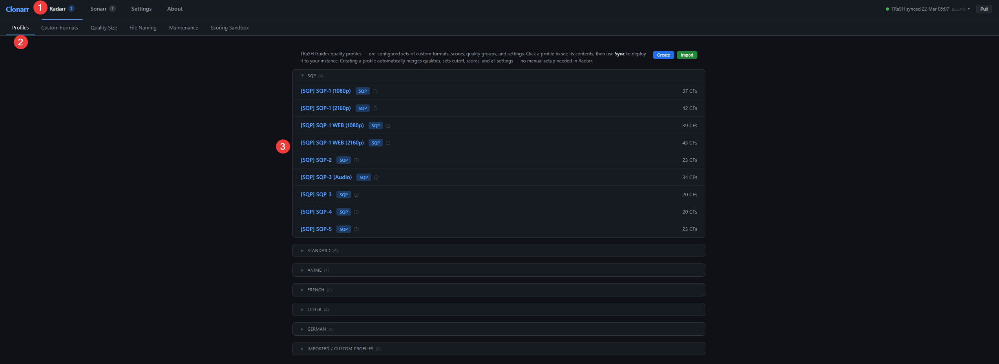

1. Select your instance type (**Radarr** or **Sonarr**)
2. Click **Profiles** in the sub-menu
3. Browse available TRaSH profiles — grouped by category (SQP, Standard, Anime, etc.). Each profile shows the number of Custom Formats included.

### Review profile contents

Click a profile to see its full details before syncing.

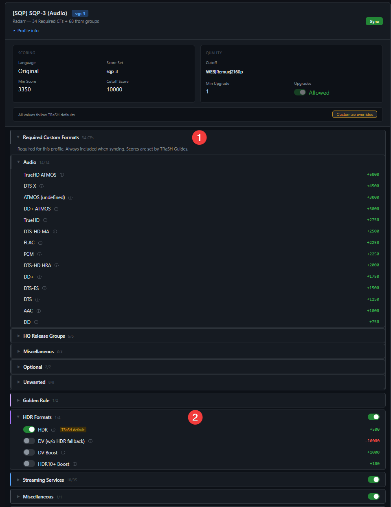

The profile detail view shows:

1. **Required Custom Formats** — Always included when syncing. Scores are set by TRaSH Guides and cannot be changed. Expand each category (Audio, HQ Release Groups, etc.) to see individual CFs and their scores.
2. **Optional groups** — Toggle groups on/off with the switch. These are opt-in — for example, HDR Formats lets you choose whether to include HDR, DV Boost, or HDR10+ scoring. Groups marked with "TRaSH default" show the recommended selection.

At the top you'll see the profile's scoring and quality settings (language, cutoff, min score, upgrade settings). Click **Customize overrides** if you need to adjust any values before syncing.

### Create new profile

When you're ready, click **Sync** to open the sync modal.

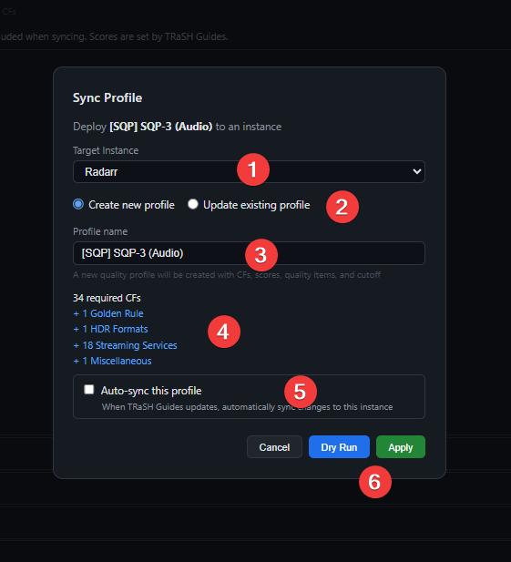

1. **Target Instance** — Select which Radarr/Sonarr instance to sync to
2. **Create new profile** / **Update existing profile** — Choose create for first-time setup
3. **Profile name** — Defaults to the TRaSH profile name. You can change it to any name you like
4. **Summary** — Shows how many CFs will be created, including optional groups you enabled
5. **Auto-sync** — Optionally enable automatic syncing when TRaSH Guides updates
6. **Dry Run** or **Apply** — Dry Run shows what would change without making any modifications. Apply syncs immediately.

> **Tip:** If a profile with the same name already exists, Clonarr will warn you. You can either choose a different name to create a separate profile, or switch to **Update existing profile** to sync changes to the existing one.

### Dry run

Click **Dry Run** to preview the changes before applying.

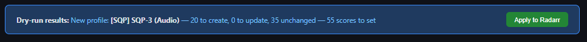

The dry run banner shows exactly what will happen — how many CFs will be created, updated, or left unchanged, and how many scores will be set. Click **Apply to Radarr** to execute the sync.

### Update existing profile

To update a profile that's already been synced, use **Update existing profile**.

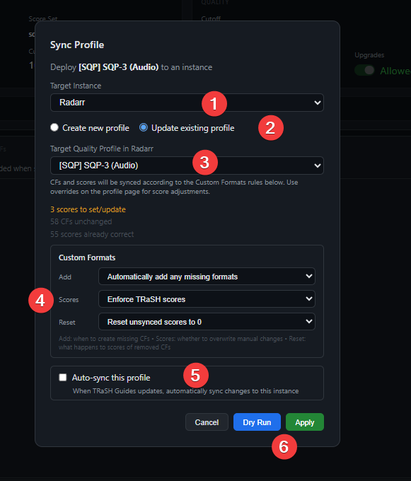

1. **Target Instance** — Same as before
2. **Update existing profile** — Selected
3. **Target Quality Profile** — Select the existing profile in your Arr instance
4. **Custom Formats rules** — Control how the sync behaves:
   - **Add** — Automatically add any missing CFs, or skip new ones
   - **Scores** — Enforce TRaSH scores (overwrite manual changes) or keep manual adjustments
   - **Reset** — What to do with scores for CFs no longer in the TRaSH profile
5. **Auto-sync** — Enable to keep the profile in sync automatically
6. **Dry Run** or **Apply**

### Sync complete

After applying, you'll see a confirmation with the results.

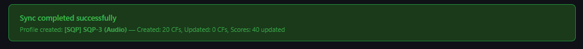

The profile is now live in your Radarr/Sonarr instance with all CFs, scores, quality settings, and cutoff configured.

---

## 3. Quality Sizes

Quality sizes control the minimum, preferred, and maximum file size (in MB per minute of video) that Radarr/Sonarr will accept for each quality level. TRaSH Guides provides recommended values.

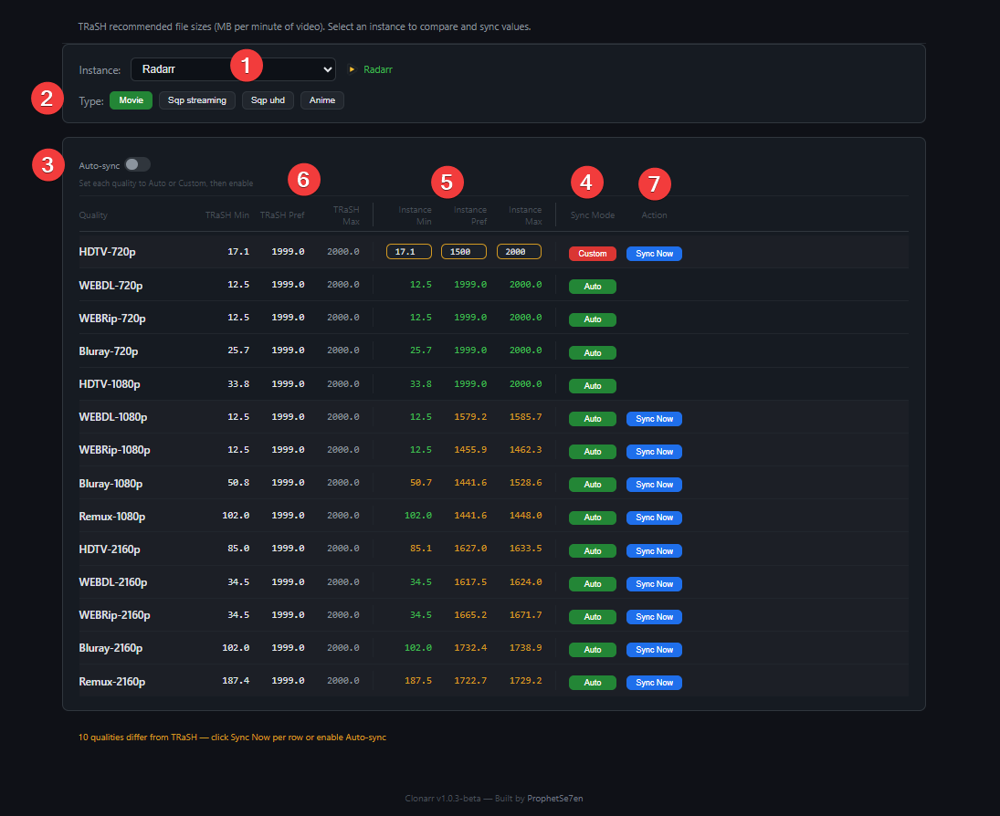

1. **Instance** — Select which Radarr or Sonarr instance to compare and sync
2. **Type** — Choose the quality size preset (Movie, SQP Streaming, SQP UHD, Anime). Each preset has different recommended values.
3. **Auto-sync** — When enabled, Auto-mode qualities are automatically updated whenever TRaSH Guides updates. Set each quality to Auto or Custom before enabling.
4. **Sync Mode** — Controls how each quality is handled:
   - **Auto** (green) — Follows TRaSH recommended values. These are synced automatically when Auto-sync is enabled.
   - **Custom** (red) — Uses your own values. Click Auto to switch to Custom mode — the instance values become editable fields where you can set your own Min, Preferred, and Max. Custom values are never overwritten by Auto-sync.
5. **Action** — When instance values differ from TRaSH (shown in yellow), a **Sync Now** button appears. Click it to update that quality to TRaSH values immediately.

The TRaSH columns (left) show recommended values. The Instance columns (right) show what's currently set in your Radarr/Sonarr. Values matching TRaSH are shown in green, differences in yellow.

---

## 4. File Naming

TRaSH Guides provides recommended naming schemes for folders and files. Adding quality, source, release group, and other metadata to filenames prevents duplicate downloads and helps Radarr/Sonarr identify what you already have.

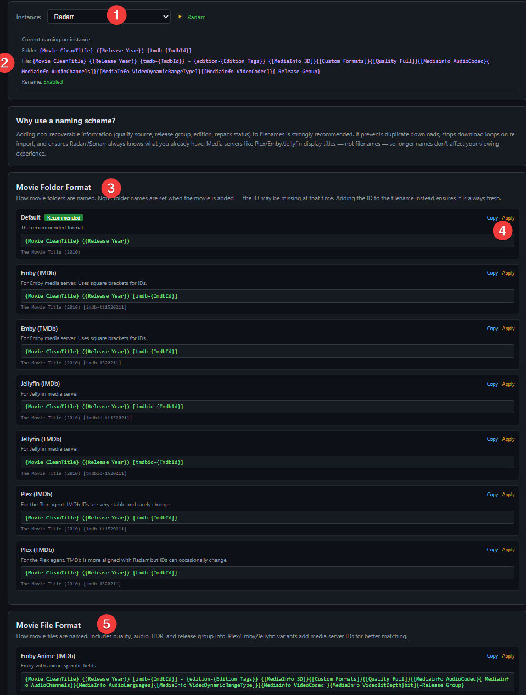

1. **Instance** — Select which Radarr or Sonarr instance to configure
2. **Current naming** — Shows the folder format, file format, and rename status currently set on your instance
3. **Movie Folder Format** — Choose how movie folders are named. Each option shows a description, the format string, and a preview. The **Recommended** tag marks the TRaSH default.
4. **Copy** copies the format string to your clipboard. **Apply** sends it directly to your Radarr/Sonarr instance.
5. **Movie File Format** — Choose how movie files are named. These are more detailed, including quality, audio, HDR, and release group info. Variants for Plex, Emby, and Jellyfin add media server IDs for better library matching.

> **Note:** Choose the format that matches your media server (Plex, Emby, Jellyfin) and ID preference (IMDb or TMDb). There is no single "correct" choice — pick what fits your setup. Scroll down to see all available formats for both folders and files.
