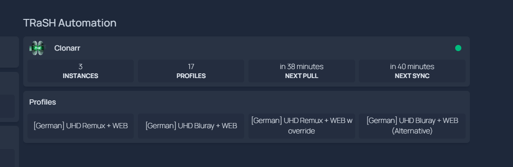

# Homepage widget

Show Clonarr stats on your [gethomepage](https://gethomepage.dev) dashboard.

> **Available on `:dev` and `:preview` only.** Will ship to `:latest` with the next release.



## 1. Get your API key

In Clonarr: **Settings → API → copy the key.**

## 2. Add to `services.yaml`

```yaml
- TRaSH Automation:
    - Clonarr:
        icon: https://raw.githubusercontent.com/ProphetSe7en/clonarr/main/ui/static/icons/clonarr.png
        href: http://CLONARR_HOST:6060/
        widget:
            type: customapi
            url: http://CLONARR_HOST:6060/api/widget/summary
            method: GET
            headers:
              X-Api-Key: YOUR_API_KEY
            refreshInterval: 30000
            display: block
            mappings:
              - field: { instances: total }
                label: Instances
              - field: { rules: total }
                label: Profiles
              - field: { trash: nextPull }
                label: Next pull
                format: relativeDate
                defaultValue: "Off"
              - field: { autoSync: nextSync }
                label: Next sync
                format: relativeDate
                defaultValue: "Off"
    - Radarr Profiles:
        widget:
            type: customapi
            url: http://CLONARR_HOST:6060/api/widget/summary
            headers:
              X-Api-Key: YOUR_API_KEY
            refreshInterval: 30000
            display: block
            mappings:
              - field: { rules: radarrTotal }
                label: Total
              - field: { rules: { radarrList: { 0: arrProfileName } } }
                label: " "
              - field: { rules: { radarrList: { 1: arrProfileName } } }
                label: " "
    - Sonarr Profiles:
        widget:
            type: customapi
            url: http://CLONARR_HOST:6060/api/widget/summary
            headers:
              X-Api-Key: YOUR_API_KEY
            refreshInterval: 30000
            display: block
            mappings:
              - field: { rules: sonarrTotal }
                label: Total
              - field: { rules: { sonarrList: { 0: arrProfileName } } }
                label: " "
              - field: { rules: { sonarrList: { 1: arrProfileName } } }
                label: " "
```

Swap `CLONARR_HOST`, `YOUR_API_KEY`. Add more `2: arrProfileName`, `3: arrProfileName` rows to show more profiles per type.

## What you can show

| Field | What it is |
|---|---|
| `instances.total` | How many Arr instances are configured |
| `instances.radarr` / `sonarr` / `paused` | Per-type and paused counts |
| `rules.total` / `active` / `withErrors` | Sync rule counts |
| `rules.radarrTotal` / `sonarrTotal` | Profile count per app type |
| `rules.radarrList[n].arrProfileName` | Nth Radarr profile name |
| `rules.sonarrList[n].arrProfileName` | Nth Sonarr profile name |
| `trash.nextPull` | When TRaSH-Guides will pull next |
| `trash.lastPull` | When TRaSH-Guides was last pulled |
| `autoSync.nextSync` | When the force-sync schedule fires next |
| `autoSync.lastSync` | When any rule last synced |
| `autoSync.lastError` | First error from any rule (empty when clean) |

## Verify the endpoint works

```bash
curl -H "X-Api-Key: YOUR_KEY" http://CLONARR_HOST:6060/api/widget/summary
```

You should get a JSON response. If you get `401 Unauthorized`, the key is wrong. If you get `404`, you're on `:latest` — upgrade to `:dev` or `:preview`.
